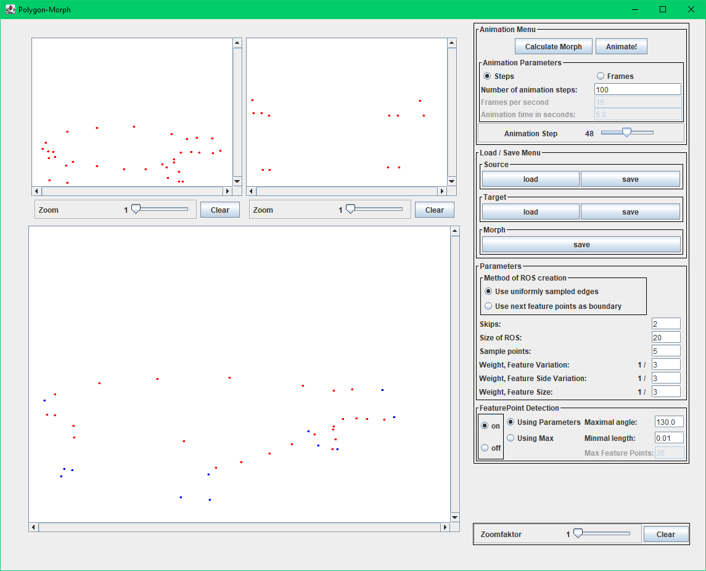
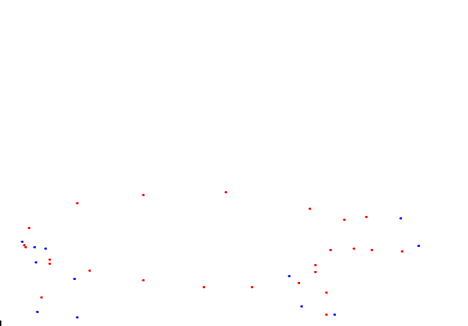

# Polygon Morphing

This repository hosts source code for the Java app accompanying Sven Albrecht's *Polygon Morphing* [thesis](http://www2.inf.uos.de/prakt/pers/dipl/svalbrec/thesis.pdf), which seeks to provide a solution to the vertex correspondence problem and vertex path problem found in 2D polygon morphing. The source code was extracted by decompiling the original java applet then cleaning/fixing the source.

